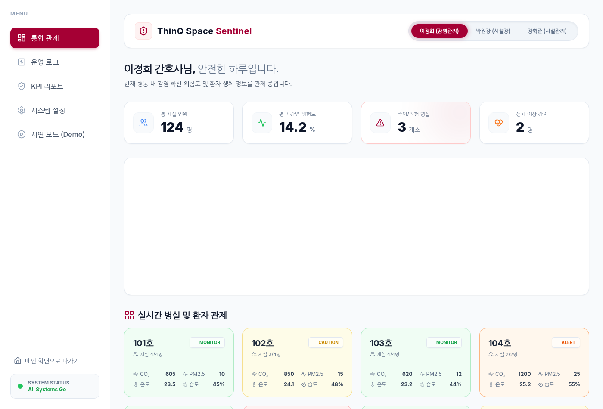
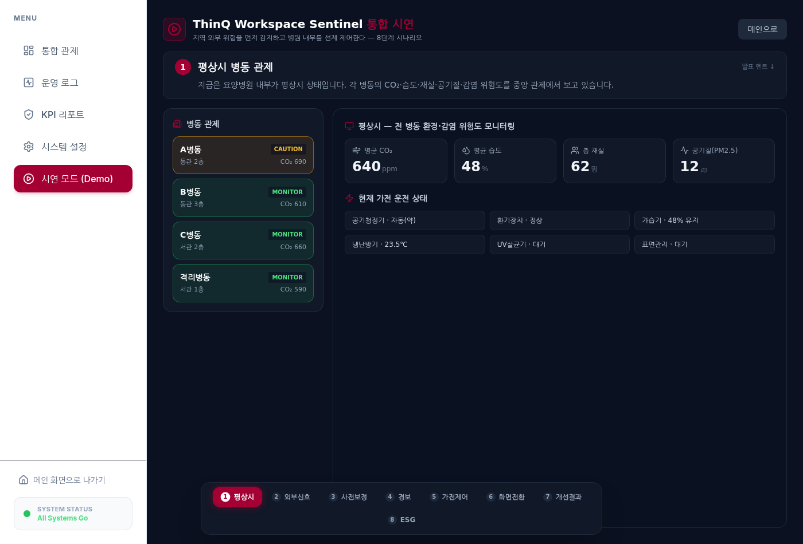
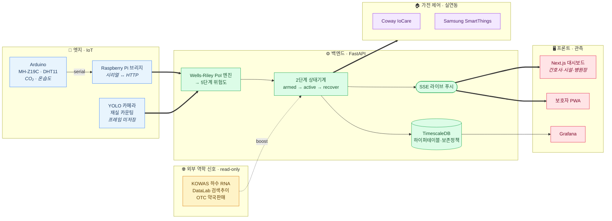

# ThinQ Workspace Sentinel

> **요양병원 집단감염을, 가전이 2~3주 먼저 감지하고 자동으로 차단한다.**
> 외부 역학 신호(하수 RNA·검색추이·약국판매) + 실내 IoT 센서를 융합해 감염 위험을 5단계로 산정하고, LG ThinQ 가전을 위험도에 맞춰 자동 제어하는 IoT 감염 사전대응 시스템.

<p>
  
  
  
  
  
  
  
</p>

**LG DX School 5기 캡스톤 PoC** · 2026.05.19 – 06.25 (6주) · 5인 팀 · **BX → CX → DX → 배포 전 과정 수행**

---

## 이 프로젝트가 특별한 이유

단순 기술 PoC가 아니라 **브랜드 경험(BX) → 고객 경험(CX) → 디지털 전환/기술구현(DX) → 실배포**까지 제품화 전 과정을 직접 수행했습니다.

| 단계 | 핵심 산출물 | 포트폴리오 문서 |
|---|---|---|
| 🎨 **BX** 브랜드 경험 | 네이밍·슬로건, 5단계 위험 컬러 시스템, 발표덱 디자인 시스템, 부스 홍보영상(v13) | **[01_BX_브랜드경험](docs/portfolio/01_BX_브랜드경험.md)** |
| 💚 **CX** 고객 경험 | 페르소나 4종, 75,633건 LDA 시장검증, 고객여정 맵, 역할별 UX, 감염예방관리료 ROI | **[02_CX_고객경험](docs/portfolio/02_CX_고객경험.md)** |
| ⚙️ **DX** 기술·배포 | Wells-Riley PoI 엔진, 2단계 상태기계, 실제 가전 연동, TimescaleDB, CI/CD, GCP 배포 | **[03_DX_기술과배포](docs/portfolio/03_DX_기술과배포.md)** |

---

## 한눈에 보기

요양병원은 65세 이상 면역취약 환자가 밀집해 RSV·인플루엔자·노로바이러스 **집단감염에 취약**하지만, 현재는 *증상 발생 후 신고*하는 사후 대응이 전부입니다. Sentinel은 두 개의 흐름을 결합해 이 공백을 메웁니다.

1. **피드포워드(선제)** — 질병청 하수 RNA(KOWAS)·네이버 검색추이(DataLab)·약국 OTC 판매 신호를 종합해 지역 유행을 **수 주 전** 감지하고 경보를 **armed** 상태로 올림.
2. **피드백(현장)** — 병실 CO₂·온습도·미세먼지·재실인원(YOLO 카메라)을 실시간 측정, Wells-Riley 감염확률(PoI)로 5단계 위험도를 산정.
3. **자동 대응** — 외부경보 + 실제 CO₂ 서지가 함께 확인될 때만 공기청정·환기·제습·살균 가전을 **2단계 상태기계**로 작동 → 오작동 최소화.

| 관제 대시보드 | 시연 화면 |
|---|---|
|  |  |

> **라이브 데모**: 시연용 GCP 인스턴스는 대회 종료 후 비활성화되었습니다. 데모 영상·시연 대본·발표덱은 `docs/발표/` 및 `ad-video/`에 있으며, 재기동은 요청 시 가능합니다.

---

## 문제 (CX)

| 페르소나 | 페인 포인트 |
|---|---|
| **감염관리간호사(ICN)** | 야간 1인 근무, 병동 전체를 눈으로 감시 — 초기 확산을 놓침 |
| **병원장/시설장** | 집단감염 발생 시 영업손실 + 적정성평가 등급 하락 + 행정처분 |
| **보호자(가족)** | 병원 내부 감염 상황을 알 길이 없어 불안 |
| **요양보호사** | 야간 근무 중 "지금 뭘 해야 하는지" 판단 기준 부재 |

핵심 격차: **유행이 병원에 도달하기 2~3주 전의 신호**가 활용되지 않고, 환경 대응이 **수동**입니다.
→ 시장 검증: 네이버 78,087건 크롤 → **75,633건 LDA 토픽모델링**, 감염·안전 토픽 84% 일치 ([CX 문서](docs/portfolio/02_CX_고객경험.md) 참조)

---

## 솔루션 · 핵심 기능

1. **감염병 조기경보** — 외부 3종 신호(하수 RNA·검색추이·OTC)를 신뢰도 가중 정규화하여 지역 유행을 선제 감지
2. **실시간 병동 관제** — 5단계 위험도(MONITOR→CAUTION→ALERT→HIGH_RISK→CRITICAL) 히트맵, 공기질·온습도·재실 인원
3. **ThinQ 가전 자동 제어** — 8종 가전(공기청정기·에어컨·환기·가습·제습·보일러·로봇청소기·스타일러)을 병원체·위험도에 맞춰 제어
4. **스마트 방역 프로토콜** — 8종 병원체별 Wells-Riley 파라미터(quanta·목표 온습도·ACH) 기반 대응 플랜
5. **보호자 안심 앱(PWA)** — 실시간 안전 점수·알림으로 가족 안심
6. **규제 증빙 자동화** — 9개 국내 법령 매핑 + 적정성평가/감염예방관리료 증빙 자동 로깅

---

## 아키텍처 (DX)



> 외부 역학 신호는 위험도를 **선제(armed)** 로만 끌어올리고, **실제 CO₂ 서지가 확인될 때(active)** 만 가전을 작동시킵니다 → 오작동 최소화.
> 📐 상세 아키텍처/ERD: [`docs/architecture/system_architecture.png`](docs/architecture/system_architecture.png) · [ERD](docs/설계서/diagrams/ThinQ-Sentinel_ERD.png)

- **데이터 모델**: TimescaleDB 하이퍼테이블(센서·PoI 결과·가전 액션·알림), 10년 보존 + 자동 다운샘플링, 멀티테넌트(UUID)
- **graceful degradation**: Redis·외부 UIS DB·실제 하드웨어 모두 optional — 센서 단독으로도 완결 동작
- 자세한 내용·ERD: **[DX 기술·배포 문서](docs/portfolio/03_DX_기술과배포.md)** · [ERD](docs/설계서/diagrams/ThinQ-Sentinel_ERD.png)

---

## 기술 스택

| 영역 | 기술 |
|---|---|
| **백엔드** | Python 3.12, FastAPI, asyncpg, Pydantic v2, SSE |
| **데이터** | PostgreSQL + TimescaleDB (하이퍼테이블·압축·보존정책) |
| **프론트엔드** | Next.js 14 (App Router), React 18, TypeScript, Tailwind CSS |
| **엣지/IoT** | Arduino(MH-Z19C·DHT11), Raspberry Pi 시리얼 브리지, YOLOv8n 재실 카운팅 |
| **가전 연동** | Coway IoCare(`cowayaio`), Samsung SmartThings REST API |
| **인프라** | Docker Compose(7 서비스), Prometheus + Grafana, GitHub Actions CI, GCP VM + nginx |
| **모델** | Wells-Riley(Rudnick-Milton) PoI, Edwards 2024 비정상상태 확장 |

---

## 핵심 엔지니어링 하이라이트

### 1. Wells-Riley 감염확률(PoI) 모델 — 실제 물리 계산
재호흡 분율 `f = (CO₂_in − CO₂_outdoor) / 38000` 으로 감염확률 `P = 1 − exp(−f·(I/n)·q·t)` 를 산정.
병원체별 quanta(best/typical/worst) 테이블과 Kim et al. 2025 임계값으로 5단계 분류. 정상·비정상(transient) 상태 모두 지원.
👉 [`pipeline/simulator/rebreathed.py`](pipeline/simulator/rebreathed.py)

### 2. 2단계 제어 상태기계 — 오작동 방지 설계
- **Stage 1 (armed)**: 외부경보 또는 센서 tier≥ALERT 시 무장 + **베이스라인 CO₂ 재고정**(이미 높은 CO₂의 오발화 방지)
- **Stage 2 (active)**: armed 상태에서 **실제 CO₂ 서지**(베이스라인 +300ppm & 700ppm 지속) 확인 시에만 가전 작동
- **recover**: CO₂ 회복 3초 지속 시 OFF + 15초 재무장 억제(잔류 신호 고스트 방지)
👉 [`backend/api/sensor.py`](backend/api/sensor.py)

### 3. 실제 하드웨어 통합 (mock 아님)
Coway IoCare·SmartThings 실연동, Arduino MH-Z19C NDIR(체크섬 검증), USB 핫플러그 안전 재연결, YOLO 재실 카운팅(프레임 미저장·정수 카운트만 전송 — 프라이버시 우선).

### 4. 시계열 데이터 설계
TimescaleDB 하이퍼테이블 + BRIN 인덱스 + 압축/보존 정책, 멀티테넌트 UUID, soft-delete, JSONB 확장 메타데이터.

---

## 데이터 · 검증

| 항목 | 내용 |
|---|---|
| **시장 검증** | 네이버 78,087건 직접 크롤 → **75,633건 LDA 토픽모델링**, 감염·안전 토픽 84% 일치 |
| **임상 근거** | 핵심 주장 14개 피어리뷰 대조 팩트체크 — **검증 9 / 정정 5 / 허위 0** (과장 방지) |
| **비즈니스 ROI** | 감염예방관리료 등급제(2024 개정) 연계 — 200병상 기준 연 5~8억 매출 가산, **회수 12개월 이내** |
| **법규 준수** | 의료법·감염병예방법·산업안전보건법 등 **9개 법령 매핑** + 증빙 자동화 |
| **부하 검증** | 캐시 스탬피드 수정으로 p95 9757ms → 1113ms 개선 (상세: [DX 문서](docs/portfolio/03_DX_기술과배포.md)) |

> 정직성 원칙: "환경 개입은 **기전(mechanism) 수준**에서 피어리뷰 근거가 있으나 요양병원 **결과 RCT는 부재**" — 감염률 X% 감소 같은 과대주장을 배제하고 *근거 기반 환경 + 증빙 생성*으로 포지셔닝.

---

## 빠른 시작

전제: Docker Desktop · Node 20 · Python 3.12

```bash
# 1. 클론
git clone https://github.com/zln02/thinq-workspace-sentinel.git
cd thinq-workspace-sentinel

# 2. 환경 변수 (예시값 그대로 로컬 docker용)
cp .env.example .env

# 3. 백엔드 스택 부팅 (DB + Redis + API)
docker compose -f infra/docker-compose.dev.yml up -d
curl http://localhost:8003/health      # → {"status":"ok"}

# 4. 프론트엔드 (별도 터미널)
cd frontend && npm install && npm run dev
# → http://localhost:3000
```

### API 둘러보기

```bash
curl http://127.0.0.1:8003/api/v1/pathogens          # 병원체 8종(사망률 가중)
curl http://127.0.0.1:8003/api/v1/devices            # 가전 8종(요양 우선순위)
curl http://127.0.0.1:8003/api/v1/legal              # 법령 9개
curl -X POST http://127.0.0.1:8003/api/v1/simulate \
  -H 'Content-Type: application/json' \
  -d '{"scenario":"winter_influenza","minutes":120}' # 시뮬레이션(CRITICAL→MONITOR 자동전환)
```

FastAPI 자동 문서: `http://127.0.0.1:8003/docs`

> **보안 참고**: 상태 변경(가전 제어·관리자) 엔드포인트는 기본 **fail-closed** — `SENTINEL_API_KEY`/`ADMIN_CONTROL_PW` 미설정 시 거부됩니다. 데모는 `SENTINEL_DEMO=1`로 명시 활성화. (읽기 전용 엔드포인트는 공개)

---

## 테스트 & CI

```bash
python -m pytest tests/ -v        # 백엔드 단위/통합 테스트 — 73 passed
```

- **CI** (`.github/workflows/ci.yml`): Ruff 린트 + pytest + 5종 시나리오 스모크 + `.env` 커밋 차단(secret-scan)
- 백엔드 핵심 로직(PoI·tier·quanta·auth·control·external boost) 단위 테스트 + 보안 fail-closed 테스트 포함.
- 정직 고지: 프론트엔드 자동 테스트는 아직 미비(로드맵에 명시).

---

## 시연 시나리오 (검증 완료)

| 시나리오 | 계절 | 병원체 | 초기 PoI | 최종 PoI | 적용 액션 |
|---|---|---|---|---|---|
| winter_influenza | 겨울 | 인플루엔자 | 30.2% | 0.5% | 4 |
| spring_tb | 봄 | 결핵 | 30.2% | 0.1% | 2 |
| summer_norovirus | 여름 | 노로 | 30.2% | 0.01% | 5 |
| autumn_covid | 가을 | COVID-19 | 30.2% | 0.2% | 3 |
| heatwave_norovirus_double | 여름 | 폭염×노로 | 30.2% | 0.02% | 5 |

---

## 로드맵 (PoC → 제품)

- [x] **보안 1차 하드닝** — admin 기본비번 제거(fail-closed), 제어 엔드포인트 인증 강제, 데모 탈출구(`SENTINEL_DEMO`)
- [ ] **테스트 확충** — 프론트 Jest/RTL + Playwright e2e, 백엔드 커버리지 ↑
- [ ] **배포 자동화** — `deploy.yml` 구현(현재 placeholder), 무중단 배포
- [ ] **ML 포캐스터 통합** — XGBoost 14일 예측(F1 0.907)을 백엔드에 연결
- [ ] **파일럿 MOU** — 요양병원 1곳 무상 파일럿으로 실데이터·ICN 검증 확보

---

## 프로젝트 정보

**LG DX School 5기 캡스톤** · 2026.05.19 – 06.25 (6주 PoC) · 5인 팀

| 역할 | 담당 |
|---|---|
| PM / Tech Lead (ML·파이프라인·아키텍처) | 박진영 [@zln02](https://github.com/zln02) |
| Backend (FastAPI·SSE·스마트 프로토콜) | 박진 [@Parkjin0821](https://github.com/Parkjin0821) |
| Frontend (Next.js PWA·대시보드) | 윤재영 |
| DevOps / QA (인프라·CI·마이그레이션) | 정욱현 |
| Strategy / Design (CX·BX·발표) | 조근범 |

**포트폴리오 문서**: [팀원 가이드](docs/portfolio/00_팀원_포트폴리오_가이드.md) · [BX 브랜드경험](docs/portfolio/01_BX_브랜드경험.md) · [CX 고객경험](docs/portfolio/02_CX_고객경험.md) · [DX 기술과배포](docs/portfolio/03_DX_기술과배포.md)
**기타 문서**: 설계서·ERD([`docs/설계서/`](docs/설계서/)) · 법규 매트릭스([`docs/legal/`](docs/legal/)) · 비즈니스 모델([`docs/business/`](docs/business/)) · 검증 리포트([`docs/test/`](docs/test/)) · 발표/시연([`docs/발표/`](docs/발표/)) · 팀 온보딩([`docs/dev/팀_온보딩_README.md`](docs/dev/팀_온보딩_README.md))

---

## 학술 · 법적 근거

Rudnick & Milton (2003) 재호흡 CO₂ 모델 · Edwards (2024) 비정상상태 확장 · Kim et al. (2025) 5단계 임계값 · REHVA COVID-19 가이드 · Escombe (2007) UVGI · Lowen (2007) 습도-인플루엔자 · 질병관리청 지침.
보안/개인정보: 시크릿은 `.env`(git ignored), 카메라는 영상 미저장·정수 카운트만 전송, 입소자 PII는 `anonymized_id`(SHA-256) — ISMS-P 지향.

## 라이선스

MIT License. 폰트(NotoSansKR, OFL) 외 일부 대용량 산출물(영상 원본·중간 프레임)은 저장소에서 제외되어 있습니다.
