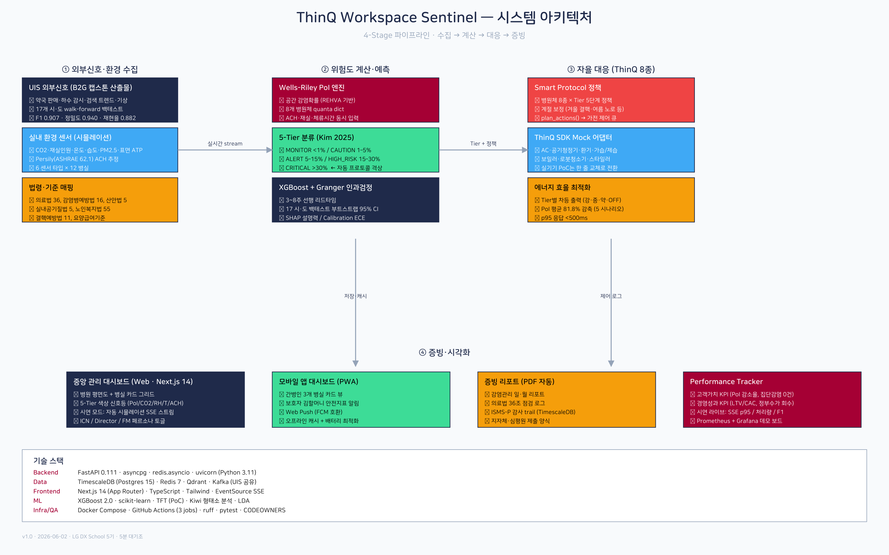
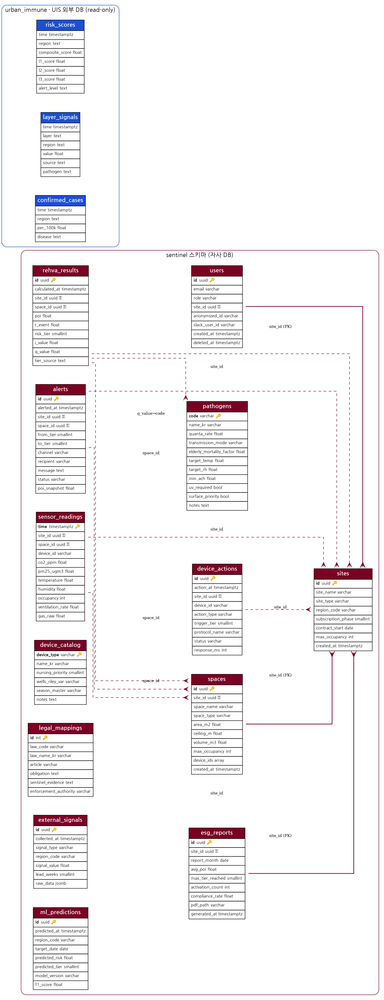

# 03. DX · 기술 구축과 배포 (Digital Transformation & Deployment)

> **ThinQ Workspace Sentinel** — 요양병원 감염 조기대응 시스템
> LG DX School 5기 캡스톤 · DX/엔지니어링 트랙
> 작성 관점: 아키텍처 → 핵심 알고리즘 → 엣지/IoT → 실가전 통합 → 데이터 → 외부신호 → 관측 → 배포 → 성능검증

---

## 한 줄 컨셉

> **"센서가 잰 CO₂ 한 값을, 감염확률 → 5단계 등급 → 실제 가전 제어까지 한 흐름으로 흘려보내는 풀스택."**

목업이 아니다. 아두이노가 측정한 실측 CO₂가 Rudnick-Milton 물리식을 거쳐 감염확률로 환산되고, 그 등급이 **실제 코웨이 공기청정기와 삼성 SmartThings 에어컨**을 작동시킨다. 본 문서는 그 엔드투엔드 파이프라인을 코드 레벨에서 기술한다. PoC 단계의 한계(ML 예측기 미통합, 배포 워크플로 플레이스홀더 등)도 정직하게 명시한다.

---

## 1. 시스템 아키텍처

전체 구조는 **엣지(측정) → 백엔드(판정·거버넌스) → 가전(대응) → 대시보드(가시화)** 의 단방향 데이터 흐름에, 외부 감염병 신호를 read-only로 융합하는 구조다.


> 다이어그램 원본: [`docs/architecture/system_architecture.png`](../architecture/system_architecture.png) · [`docs/설계서/diagrams/ThinQ-Sentinel_아키텍처.png`](../설계서/diagrams/ThinQ-Sentinel_아키텍처.png) (생성 스크립트 [`gen_arch.py`](../설계서/diagrams/gen_arch.py))

### 데이터 흐름 (실측 경로)

```
[아두이노 Uno]  DHT11(온습도) + MH-Z19C(NDIR CO₂)
     │ USB 시리얼 9600baud  "온도:23.80C 습도:48.00% CO2:650"
     ▼
[라즈베리파이 bridge.py]  정규식 파싱 → HTTPS POST
     │                                        [노트북 카메라 counter.py]
     │  POST /api/v1/sensor/reading            YOLOv8 person 검출 → occupancy=N
     ▼                                          │ (프레임 비저장, 정수만 전송)
[FastAPI sensor.py · ingest_reading] ◀──────────┘
     │  ① 코웨이 실측 CO₂/PM2.5 병합  ② carry-forward(피드 합성)
     │  ③ Rudnick-Milton PoI 산출   ④ 5-Tier 분류   ⑤ 2단계 상태기계
     ├──▶ TimescaleDB 적재 (sensor_readings, rehva_results)
     ├──▶ 가전 제어 (Coway IoCare / SmartThings)  ── 위험 시 TURBO/송풍, 회복 시 OFF
     ├──▶ 아두이노 회신 "TIER:ALERT\n" → 5단 LED 게이지
     └──▶ SSE publish_live() → 대시보드 실시간 푸시(공식 대입값 포함)
                                    ▲
[UIS urban_immune DB] ── read-only ─┘  KOWAS·DataLab·OTC·확진 → 외부 조기경보 boost
```

엔트리포인트는 [`backend/api/main.py`](../../backend/api/main.py)다. FastAPI `lifespan`에서 asyncpg 풀(sentinel DB), 선택적 Redis, 코웨이/SmartThings 어댑터, UIS read-only 풀을 조건부로 초기화한다. 어댑터·외부 DB·Redis는 모두 **환경변수 미설정 시 graceful degradation**(None으로 비활성)하여, 자격증명 없이도 데모가 깨지지 않으면서 운영에서는 완전 가동된다.

핵심 설계 원칙:
- **상태 비저장 ingest**: `POST /reading`은 인메모리 캐시(carry-forward, 상태기계) 외 영속 상태가 없어 수평 확장 친화적.
- **핫패스 논블로킹**: 가전 클라우드 호출(수초)은 ingest 임계경로에서 제거하고 백그라운드 단일 갱신으로 분리(§9 부하테스트가 발견·수정).
- **fail-closed 보안**: 변경 엔드포인트(POST)는 `SENTINEL_API_KEY` 강제([`backend/api/auth.py`](../../backend/api/auth.py)), GET/SSE는 공개.

---

## 2. 핵심 알고리즘

### 2-1. Rudnick-Milton CO₂-프록시 Wells-Riley 모델

핵심 구현: [`pipeline/simulator/rebreathed.py`](../../pipeline/simulator/rebreathed.py)

전통적 Wells-Riley는 환기량(ACH)·체적(V) 추정이 필요해 현장 적용이 어렵다. Rudnick & Milton(2003, *Indoor Air* 13(3):237-245)은 **실내 CO₂ 농도가 "남이 내쉰 공기를 다시 들이마신 비율(재호흡 분율 f)"을 직접 반영**한다는 점을 이용해, CO₂ 측정값만으로 감염확률을 산출한다.

```
재호흡 분율   f = (C_in − C_out) / C_exhaled
감염확률      P = 1 − exp( − f · (I/n) · q · t )
```

| 기호 | 의미 | 코드 상수/값 |
|---|---|---|
| `C_exhaled` | 날숨 CO₂ 농도 | `38000 ppm` (Rudnick-Milton 2003) |
| `C_outdoor` | 외기 CO₂ 기준 | `420 ppm` (현대 대기) |
| `I / n` | 감염자수 / 전체 재실 | 평상시 I=0(PoI 0), 외부경보 시 I=1 |
| `q` | quanta 방출률 | 병원체별 (인플루엔자 30 등) |
| `t` | 노출 시간 | 1.0 h |

quanta 불확실성(변종·활동량)은 숨기지 않고 **worst/typical/best 3구간**으로 명시(`QUANTA_SCENARIOS`): COVID-19 14/60/300, 인플루엔자 15/30/100, RSV 8/20/70, TB 1/13/60, 노로 0.5/1/5 quanta/h. `sensitivity_analysis()`로 발표·QA 방어용 민감도 표를 생성한다.

추가로 정상상태 가정을 벗어난 **과도기(transient) 모델** `infection_probability_transient()`도 구현 — CO₂ 시계열을 사다리꼴 적분(`D = (I/n)·q·∫f(t)dt`)해 환기 변동을 그대로 반영한다(Edwards 2024 기반).

### 2-2. 5단계 위험 분류 (PoI → Tier)

```python
_POI_THRESHOLDS = [(0.30,"CRITICAL"), (0.15,"HIGH_RISK"), (0.05,"ALERT"), (0.01,"CAUTION")]  # 그 외 MONITOR
```

시뮬레이터([`space.py`](../../pipeline/simulator/space.py))는 더 보수적으로 **2축(PoI × R_event=PoI×감수성인원)** 중 엄격한 쪽으로 결정(Kim et al. 2025, *Applied Sciences* 15:9145). 라이브 판정([`sensor.py`](../../backend/api/sensor.py) `compute_tier`)은 감염위험(CO₂/가스) tier와 환경위험(온습도) tier 중 **더 높은 등급을 채택** — ASHRAE 적정 40~60% RH 이탈 시 단계 상향. 빈 병실(occupancy=0)은 PoI 0 → MONITOR로 자연 처리되어 "사람 없는데 위험" 모순을 제거한다.

### 2-3. 2단계 상태기계 (armed → active → recover)

[`sensor.py`](../../backend/api/sensor.py)의 가장 정교한 부분. **"외부 경보는 판정 기준만 올리고, 실제 가전은 CO₂가 진짜 급상승할 때만 켠다"** 는 2단계 거버넌스다. 공기청정기는 CO₂를 직접 제거하지 못하므로, 회복 판정은 가전 명령 시각이 아니라 **실측 CO₂로만** 한다.

| 상태 | 전이 조건 | 주요 파라미터 |
|---|---|---|
| **armed** | 외부 조기경보 발령(ext_boost≠MONITOR), 가전은 대기 | 발령 순간 `baseline`을 현재 CO₂로 재기준(오발동 방지) |
| **active** | baseline 대비 **+300 ppm 급상승**(`_CO2_SURGE_DELTA`) AND sensor_tier≥ALERT | 발령 시 코웨이 TURBO + 에어컨 송풍 |
| **recover** | 피크 대비 **−100 ppm 하강**(`_CO2_RECOVERY_DROP`) AND ≤2000 ppm, **3초 연속** | 회복 후 15초 재가동 쿨다운(`_CO2_REARM_COOLDOWN`) |

- baseline은 평상 구간에서만 EMA(`0.85·prev + 0.15·co2`)로 적응 — 방마다 절대농도가 달라(500~1100 ppm) 절대 임계 대신 **"이 방 평균 대비 상승폭"** 으로 급상승을 판정.
- 실측 입김 검증: 평상 ~440 ppm → 입김 시 ~900 ppm까지 도달(`_CO2_SURGE_MIN=700`).
- 공간별 `asyncio.Lock`으로 거버넌스 직렬화 — 같은 병동에 reading이 빠르게 연속 유입돼도 tier 전이~가전 액추에이션이 인터리브되지 않게 보장.

**carry-forward + 디바운스**: 카메라(occupancy)와 CO₂ 센서가 서로 다른 POST로 따로 들어오므로, 직전 신선값(TTL 300초)으로 미측정 필드를 보충(`_carry_forward`)하고, YOLO가 프레임을 놓쳐 0↔N 깜빡이면 직전 인원을 10초 유지(`_smooth_occupancy`)해 등급 튐을 흡수한다.

---

## 3. 엣지 / IoT — 프라이버시 우선

### 3-1. Arduino 센서 노드 ([`rpi/firmware/sentinel_node.ino`](../../rpi/firmware/sentinel_node.ino))

Arduino Uno/Nano(AVR)에 다음을 연결:
- **MH-Z19C** NDIR CO₂ 센서 (SoftwareSerial, UART 0x86 read 명령 직접 구현, 체크섬 검증, 워밍업/오류 시 `-1` 반환). MH-Z19B와 핀·프로토콜 완전 호환.
- **DHT11** 온습도 (DHT22 고장으로 대체).
- **5단 LED 게이지** (D3~D7, MONITOR~CRITICAL 누적 점등) + **I2C LCD**(0x27) 실시간 표시.

라파이가 회신한 `TIER:XXX\n`을 폴링해 LED 게이지를 갱신하는 **양방향** 통신. Uno의 하드웨어 시리얼이 1개(USB)뿐이라 CO₂는 SoftwareSerial로 처리.

### 3-2. 라즈베리파이 브리지 ([`rpi/bridge.py`](../../rpi/bridge.py))

시리얼(`/dev/ttyACM*` 자동 탐색) → 정규식 파싱 → `POST /api/v1/sensor/reading`. USB 재연결로 ACM0↔ACM1이 바뀌어도 견고하게 동작하고, **시리얼 단절 시 자체 재연결**(systemd에 의존 안 함). CO₂가 `-1`(워밍업)이면 전송 생략 → 백엔드 코웨이 폴백 유지. 백엔드 인증키는 `X-API-Key` 헤더로 전송.

### 3-3. YOLO 재실 카운팅 ([`camera/counter.py`](../../camera/counter.py)) — 개인정보 핵심

역할분리 설계: **카메라(노트북 YOLOv8)가 재실 인원수 주력 제공, 아두이노는 환경센서 전용.**

> **프라이버시 우선**: 프레임은 **절대 저장/전송하지 않는다.** YOLO `person`(COCO class 0) 검출 후 `del frame`으로 영상을 메모리에서 즉시 폐기하고, **검출된 사람 수(정수)만** 네트워크로 나간다. 개인정보보호법 제25조(영상정보처리기기) 리스크를 설계 단계에서 최소화 — B2G/요양병원 도입의 필수 요건.

`count_people(frame)->int` 한 함수만 교체하면 다른 검출 모델로 대체 가능. VM이 노트북 카메라 MJPEG를 중계(proxy)하는 경로도 제공(`/camera/stream`).

---

## 4. 실제 가전 통합 (Mock 아님)

핵심 차별점: 동일한 `async_post_device_control(device_id, body)` **인터페이스**로 벤더를 추상화해, `ThinQApiMock` → 실기기 어댑터를 **한 줄 교체**로 실증 가능.

### 4-1. 코웨이 IoCare ([`backend/services/coway_adapter.py`](../../backend/services/coway_adapter.py))

`cowayaio` 라이브러리를 ThinQ 호환 인터페이스로 래핑. `.env`의 `COWAY_USERNAME/PASSWORD`로 지연 로그인.
- **제어**: `{"airFlow":{"windStrength":"TURBO"}}` → `async_set_rapid_mode()`, `{"operation":{"airPurifierOperationMode":"ON/OFF"}}` → 전원.
- **센서로도 활용**: `async_get_air_quality()`가 PM2.5/PM10/**CO₂**/VOC/AQI 실측을 반환 → tier 계산 입력 + 대시보드 표출. 소비전력은 API 미제공이라 풍량 단계로 추정(`_estimate_power_w`, '추정' 라벨).

### 4-2. 삼성 SmartThings 에어컨 ([`backend/services/smartthings_adapter.py`](../../backend/services/smartthings_adapter.py))

SmartThings REST API(`api.smartthings.com/v1`) 직접 호출. PAT 토큰 인증, 기기목록에서 에어컨 **자동 탐색**(`airConditionerMode` capability). ThinQ/Coway 호환 body를 SmartThings capability 명령으로 변환(windStrength→fanMode, mode→airConditionerMode, target→thermostatCoolingSetpoint). 위험 시 송풍/제습으로 환기 보조(Wells-Riley Q_aux).

### 4-3. Smart Protocol — 병원체×등급×계절 차등 정책 ([`backend/services/smart_protocol.py`](../../backend/services/smart_protocol.py))

8종 병원체 × 5-Tier × 계절 → 가전 8종(공기청정기·에어컨·환기청정기·가습기·제습기·보일러·로봇청소기·스타일러)의 차등 제어 명령을 생성. 예: 인플루엔자는 "저온저습 시 비말 안정성↑(Lowen 2007)" 근거로 22°C·50% RH + 가습기, 노로는 "표면 핵심"이라 제습 + 로봇 살균, 옴은 스타일러 트루스팀. `_purifier_strength()`로 **평상시 대기 → 경보 시 TURBO** 차등(항상 최대가 아님).

> **실기기 마스터 스위치** `SENTINEL_ACTUATE`: 기본 OFF(데모 안정화 — ingest마다 제어가 난무하던 문제 방지). 상태 조회/대시보드 표시는 항상 동작하고, `.env`에 `SENTINEL_ACTUATE=1` + 재기동 시 완전 제어 복원.

---

## 5. 데이터 엔지니어링 — TimescaleDB

스키마: [`migrations/001_init_sentinel.sql`](../../migrations/001_init_sentinel.sql) ~ `005`. UIS의 기존 TimescaleDB(`uis` DB)에 **`sentinel` 전용 schema**로 분리 적재(멀티테넌트 격리).


> ERD 원본: [`docs/설계서/diagrams/ThinQ-Sentinel_ERD.png`](../설계서/diagrams/ThinQ-Sentinel_ERD.png) · DBML 정의 [`erd.dbml`](../설계서/diagrams/erd.dbml)

### 하이퍼테이블 & 정책

| 테이블 | chunk_interval | 보존정책 | 비고 |
|---|---|---|---|
| `sensor_readings` | 7 days | **10년** | 환경 시계열. BRIN(time) + 복합 인덱스(site,space,time) |
| `rehva_results` | 30 days | — | PoI/risk_tier 산출 결과. KPI·리포트 소스 |
| `device_actions` | 30 days | — | 가전 제어 이력(응답시간 포함) |
| `alerts` | 30 days | **10년** | 경보 발송 감사로그 |

- **멀티테넌트**: `sites`(요양병원) → `spaces`(병동) 계층, 모든 시계열이 `site_id`/`space_id` FK 보유. `subscription_phase`(0/1/2)로 단계별 구독.
- **생성 컬럼**: `spaces.volume_m3 = area_m2 × ceiling_m` (STORED) — Wells-Riley 입력 자동 계산.
- **무결성 제약**: `poi BETWEEN 0 AND 1`, `risk_tier BETWEEN 1 AND 5` 등 CHECK로 산출값 범위 보장.
- **RBAC**: `users.role`을 002 마이그레이션에서 요양병원 6종(ICN/DIRECTOR/FM/CAREGIVER/RESIDENT/GUARDIAN)으로 확장.

### 도메인 마스터 (002 피벗)

사무실 → 요양병원 도메인 피벗. **병원체 8종**(`pathogens`: COVID-19 quanta 25·고령 사망률 90배 등 학술 출처 명시), **가전 8종**(`device_catalog`: Wells-Riley 변수 매핑), **법령 9개**(`legal_mappings`: 적정성평가 증빙 직결). 003에서 의료법 시행규칙 별표4 기준(1병상 6.3㎡, 천장고 2.7m) 실제 병동(45㎡ 다인실 121.5㎥, 12㎡ 음압격리실 등)과 실재 요양병원 6곳을 시드.

### 다병동 라우팅

논리 `space_id`("ward_a"~"ward_e" 또는 임의 문자열)를 물리 WARD UUID로 매핑(`_resolve_space`, 60초 캐시). 인덱스/해시 분산으로 단말마다 다른 병동에 적재 → 부하테스트에서 5병동 균등 분산(각 1210건) 검증.

---

## 6. 외부 신호 파이프라인 (read-only 융합)

UIS 팀이 적재한 `urban_immune` DB를 **절대 수정 없이 SELECT only**로 소비해, 센서가 정상이어도 외부 확산이 임박하면 실내 tier를 선제 상향(사전예방).

- [`backend/services/uis_reader.py`](../../backend/services/uis_reader.py): `layer_signals`(하수 KOWAS·검색 DataLab·약국 OTC), `risk_scores`(조기경보 composite + alert_level), `confirmed_cases`(확진)를 읽어 sentinel 코드/지역으로 정규화. 연결 실패 시 빈 결과로 단락(graceful degradation), raw DB 에러 클라이언트 노출 금지(ISMS-P).
- [`backend/services/external_signal.py`](../../backend/services/external_signal.py): 소스별 신뢰 가중치(**KOWAS 1.0 > DataLab 0.7 > OTC 0.5**) 적용 후 5-Tier 보정. 외부 신호가 공간 측정값보다 높을 때만 상향(보수적 원칙).
- [`backend/api/external_live.py`](../../backend/api/external_live.py): 조기경보 `risk_score`(정적 과거피크 아님)로 boost. **실증(2025-26 인플루엔자 시즌): ORANGE/RED 발령이 확진 피크보다 지역별 15~43일 선행**(부산 43일·세종 36일·서울/경기 15일, 16/17개 시도 사전 포착). 하강 국면 후행 오경보(FP)는 추세 분석(`_region_trend`/`_trend_adjust`)으로 차단.

이 boost는 §2-3 상태기계의 **armed** 트리거로 작동 — 외부 경보만으로 가전을 켜지 않고 판정 기준만 올린다.

---

## 7. 인프라 & 관측 (Observability)

### Docker Compose 7 서비스 ([`infra/docker-compose.yml`](../../infra/docker-compose.yml))

| 서비스 | 이미지/빌드 | 역할 |
|---|---|---|
| `sentinel-api` | `backend/` | FastAPI 메인(8003) |
| `sentinel-collector` | `pipeline/` | KOWAS/DataLab 외부신호 수집 |
| `sentinel-protocol` | `pipeline/Dockerfile.mcp` | ThinQ 제어 프로토콜(MCP, 8010-8013) |
| `sentinel-reporter` | `backend/Dockerfile.reporter` | ESG/경영 PDF 리포트 |
| `sentinel-redis` | `redis:7-alpine` | 헬스/캐시(선택적) |
| `sentinel-prometheus` | `prom/prometheus:v2.51` | 메트릭 수집(9090) |
| `sentinel-grafana` | `grafana/grafana:10.4` | 대시보드(subpath `/sentinel-grafana`) |

기존 UIS의 TimescaleDB·Kafka를 external network(`uis_default`)로 재사용. 모든 포트는 `127.0.0.1` 바인딩(nginx 뒤). Prometheus는 `sentinel-api:8003`을 15초 주기 스크랩([`infra/prometheus/prometheus.yml`](../../infra/prometheus/prometheus.yml)).

### 로컬 개발 스택 ([`infra/docker-compose.dev.yml`](../../infra/docker-compose.dev.yml))

`docker compose -f infra/docker-compose.dev.yml up -d` 한 줄로 TimescaleDB + Redis + API mini-stack 기동. 마이그레이션 4종을 `docker-entrypoint-initdb.d`로 자동 적용, healthcheck(`pg_isready`)로 의존성 순서 보장. 라파이(Tailscale) 접근용 IP 바인딩 포함.

> **정직성 노트**: `ml/` 디렉터리에 Dockerfile/추론 코드가 없어 `sentinel-rehva` 서비스는 **주석 비활성**. REHVA 결과는 현재 백엔드(`sensor.py`)가 직접 `rehva_results`에 적재한다. ML 예측기(`ml_predictions` 테이블·`UIS-XGBoost-v2`)는 스키마만 준비된 PoC 단계로 **아직 추론 서비스 미통합**.

---

## 8. CI/CD & 배포

### CI ([`.github/workflows/ci.yml`](../../.github/workflows/ci.yml))

`develop`/`main` push + 모든 PR에서 3개 잡 실행:
1. **python**: Ruff(E,F,W,I) → 5 시나리오 smoke(`tests/smoke_scenarios.py`) → pytest(PoI·5-Tier 단위테스트).
2. **frontend**: Next.js `npm install + build`(존재 시).
3. **secret-scan**: 커밋된 `.env` 차단(example 제외) — 자격증명 유출 방지.

> `tests/`에는 PoI·tier·과도기·carry-forward·외부 boost·SmartThings 어댑터·인증 등 11개 테스트 파일 보유.

### 배포 — GCP VM (운영, 현재 아카이브)

- **GCP e2-standard-2 VM**(`uis-capstone`, 34.47.113.176)에서 운영.
- **nginx subpath** `/sentinel`으로 서빙(Grafana도 `/sentinel-grafana` subpath 설정 `GF_SERVER_SERVE_FROM_SUB_PATH=true`).
- 엣지(라파이/노트북)는 **Tailscale 메시 VPN**으로 VM에 연결, VM이 공인 IP로 대시보드/카메라 중계 → 시청 기기가 Tailnet 밖이어도 동작.
- 현재 데모 종료로 **아카이브/철거**됨.

### 배포 — Koyeb 클라우드 옵션 ([`docs/deploy/koyeb.md`](../../docs/deploy/koyeb.md))

VM·PC 완전 독립 경로: **라파이 → Koyeb FastAPI → Supabase Postgres(서울)**. `Dockerfile`이 `$PORT` 동적 바인딩, Redis 선택적이라 무료 1서비스로 24시간 가동. 주의: Supabase는 **Session Pooler(:5432)** 필수 — asyncpg의 prepared statement가 Transaction 풀러(:6543)에서 깨지고 직결은 IPv6 전용이라 막힘.

> **정직성 노트**: [`.github/workflows/deploy.yml`](../../.github/workflows/deploy.yml)은 현재 **플레이스홀더**(workflow_dispatch 수동 트리거 + notice만 출력). VM_SSH_KEY·VM_HOST 등 Secrets 등록 후 본문을 채워 활성화하는 구조로, 자동 배포 파이프라인은 미완.

---

## 9. 부하 / 성능 검증

측정: 2026-06-08 · 대상 `POST /api/v1/sensor/reading`(실DB 적재 + tier 계산 전체 경로) · 도구 [`tools/loadtest.py`](../../tools/loadtest.py) · 환경 GCP e2-standard-2(2 vCPU) **공용 dev 박스**(UIS DB·Kafka·Qdrant·Redis 동거). 상세: [`docs/test/부하테스트_결과.md`](../../docs/test/부하테스트_결과.md)

| 부하(동시) | 처리량 | p50 | p95 | p99 | 에러 | 판정 |
|---|---|---|---|---|---|---|
| **5 (실 시연 대표)** | 188 rps | 19ms | **60ms** | 90ms | 0 | **PASS** (목표 p95<500ms의 1/8) |
| 10 | 60 rps | 82ms | 523ms | 1313ms | 0 | 경계 |
| 20 | 46 rps | 147ms | 2041ms | 4600ms | 0 | 단일 인스턴스 한계 |

### 부하테스트가 잡아낸 아키텍처 결함 (실전 엔지니어링)

1. **코웨이 클라우드 cache-stampede (치명적)**: ingest 핫패스가 코웨이 IoCare 클라우드를 동기 호출 → 5초 캐시 만료 순간 동시 50요청이 느린 클라우드를 동시에 때림. **수정**: 캐시 즉시 반환 + 만료 시 백그라운드 단일 갱신(`asyncio.create_task`, [`sensor.py`](../../backend/api/sensor.py) `_coway_aq`). **효과: p95 9757ms → 1113ms(8.7배), 에러 14 → 0.**
2. **DB 풀 부족**: asyncpg `max_size=4` → 커넥션 큐잉. **수정**: `min_size=4, max_size=12`(2 vCPU 적정값).

### 정직한 한계 & 스케일링 경로

고동시(20+)에서 테일 지연 악화 — 2 vCPU 공용 박스의 CPU/이벤트루프 포화, 단일 uvicorn 워커 한계. 상태 비저장 ingest라 ① 전용 인스턴스 ② uvicorn `--workers` 다중화 ③ k8s HPA 수평확장으로 해소 가능. 실 요양병원 규모(수십 병동 × 수초 주기 = 집계 수 rps)는 단일 인스턴스로 충분.

---

## 10. PoC 단계 명시 (정직성 요약)

| 항목 | 상태 |
|---|---|
| 실측 CO₂ → PoI → 5-Tier → 가전 제어 | ✅ 엔드투엔드 작동(실기기) |
| 코웨이/SmartThings 실기기 통합 | ✅ 실제 제어(`SENTINEL_ACTUATE=1`) |
| UIS 외부신호 read-only 융합 | ✅ 실데이터(15~43일 선행 실증) |
| TimescaleDB 하이퍼테이블·멀티테넌트 | ✅ 운영 스키마 |
| 부하/관측(Prometheus·Grafana) | ✅ 검증 + 결함 수정 |
| **ML 예측기**(`ml_predictions`/XGBoost) | ⚠️ 스키마만, 추론 서비스 미통합 |
| **deploy.yml 자동배포** | ⚠️ 플레이스홀더(수동 배포로 운영) |
| 가전 소비전력 | ⚠️ 풍량 단계 추정('추정' 라벨) |
| 비용 절감액(`EST_SAVING_PER_ACTION_KRW`) | ⚠️ 추정값(현장 수치로 교체 예정) |

> 핵심 철학: 측정 가능한 것(자동 선제대응 횟수·모니터링 커버리지·위험 변동폭)만 보고하고, "감염 예방 효능"은 단정하지 않는다 — 적정성평가 증빙에 직결되는 **정직한 데이터**.

---

*작성: DX/엔지니어링 트랙 · 근거 코드 경로는 모두 본 저장소 실파일 기준.*
