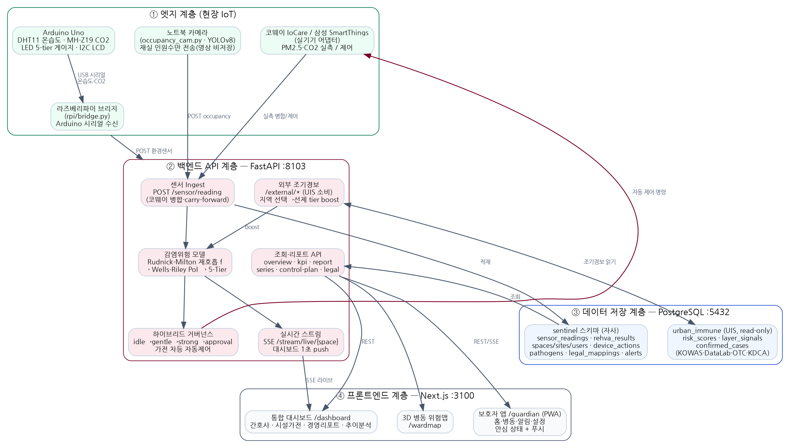

# ThinQ Space Sentinel — 최종 산출문서 (검증판)

> **5기 DX 5팀 · 5분 대기조** | 주제: LG전자 ThinQ 연동 요양병원 집단감염 선제차단 시스템 | 2026.06
>
> **본 문서는 실제 구현 코드·DB·실센서 가동 상태와 1:1 대조 검증을 거친 산출문서입니다.**
> 미구현/계획 항목은 "계획(PoC)"으로 명시하고, 구현·실증된 항목만 성과로 기재합니다.

---

## 0. 프로젝트 개요

| 항목 | 내용 |
|---|---|
| 팀명 | 5분 대기조 (5기 DX 5팀) |
| 주제 | LG전자 ThinQ 가전 연동 — 요양병원 집단감염 선제차단 |
| 핵심 한 줄 | **요양병원이 못 막던 집단감염을, 가전이 2~3주 전에 알고 자동으로 막는다** |
| 서비스명 | **Space Sentinel** — B2B SaaS + ThinQ(코웨이) 가전 제어 연동 (구독형) |
| 타깃 | 100병상+ 요양병원(전국 약 1,400개소) / 감염관리 의무 장기요양시설 |
| 실증 범위 | RPi+아두이노 실센서(201호 다인실) · 노트북 YOLO 재실 카메라 · 코웨이 IoCare 실기기 제어 · 외부 감염병 조기경보(UIS) 연동 · 5-Tier 자동 거버넌스 · 통합 대시보드 + 보호자 PWA |

---

# BX 단계 (Business eXperience)

## I. 추진 배경 및 핵심 난제

요양병원·요양시설의 집단감염은 국내 최고 치명률 집단인 **65세+ 고령 면역저하자**에게 직접 위협이 된다. 현행 시스템은 **증상 발현 후 신고**(감염병예방법 제16조) 구조로, 발현 시점에는 이미 공기·표면 확산이 완료된 상태다.

| 핵심 난제 | 내용 |
|---|---|
| 고령 취약성 | 65세+ 입소자: 인플루엔자·RSV·COVID·노로 기저면역 저하, 폐렴·패혈증 이행률 수배. 결핵·폐렴구균·CDI·옴 등 8개 위협 병원체 공존. |
| 인력 부족 | 의료법상 ICN 1명 이상 의무 → 현장은 1명이 전 병동 담당. 야간·주말 모니터링 공백이 집단감염 주원인. |
| 사후대응 한계 | 증상 발현 후 신고 구조. 발현 시점엔 이미 확산 → 격리·방역 비용이 예방 대비 수십 배. |
| 집중 과제 | 외부 유행신호(KOWAS·DataLab·OTC)와 실내 환경센서(CO₂·온습도·PM2.5)를 융합해 증상 발현 **2~3주 전 선제 탐지** + LG ThinQ 가전 자동 제어 |

## II. 이해관계자별 고객 감동 목표

| 이해관계자 | 기존 Pain | Sentinel Gain |
|---|---|---|
| 감염관리간호사(ICN) | 야간·주말 위험 파악 불가, 육감 의존 | 5-Tier 실시간 대시보드 + 등급변경 즉시 앱 푸시 → 5초 내 인지 |
| 시설장/원장 | 집단감염 후 신고·수가손실·평가감점 | 2~3주 전 외부신호 사전경보 → 예방 → 가산 유지 |
| 보호자 | 입소 가족의 감염 불안, 정보 부재 | 보호자 앱 안심지수(Tier·정상관리) 실시간 확인 |
| 규제기관 | 수기 대장·사후 보고 기반 감사 | 조치 로그 자동저장, 원클릭 PDF 증빙(9개 법령) |

## III. 데이터 수집 전략

| 타깃 소스 | 키워드 | 선정 이유(선행성) | 기간 |
|---|---|---|---|
| KOWAS(질병청 하수감시) | 인플루엔자·노로·COVID·RSV 하수 RNA | 임상신고 대비 1~3주 **최선행**(가중치 1.0) | 2024.01~2026.06 주 |
| Naver DataLab | 냄새·인력부족·야간근무 등 51개 | 검색 급등이 1~2주 선행(가중치 0.7) | 2024.01~2026.06 일 |
| 약국 OTC 판매 | 타미플루·해열·지사제 | 구매 급등이 3~5일 선행(가중치 0.5) | 2024.01~2026.06 주 |
| 네이버 블로그·뉴스·카페·지식iN | 51개 요양병원 Pain 키워드 | 현장 목소리 정성 분석 — **78,087건 수집** | 2022.01~2026.06 |

## IV. 크롤링 & 키워드 분석 결과

네이버 API 4채널 × 51키워드 × 5페르소나 직접 크롤링. **전 건 재현 가능**(`scripts/cx/run.py`).

**채널별 수집:** 뉴스 26,696(34.2%) · 블로그 22,745(29.1%) · 카페 20,097(25.7%) · 지식iN 8,549(11.0%) → **총 78,087건 수집 → 75,633건 분석**

**페르소나별 부정도:** 종사자 84.0% · 정책 79.5% · 시설장 66.5% · 가족 55.2% · 경쟁사 15.5%

**Top 키워드:** 냄새(3,001) · 인증평가(2,985) · 욕창(2,979) · 인력부족(2,976) · 부모님후회(2,975) · 낙상(2,969) · 면회제한(2,923) · 야간근무(2,869) · 공기청정기(2,759)

## V. 데이터 전처리 파이프라인

수집 78,087건 → 정제(HTML·중복·단문 제거) → **75,633건 확정** → Kiwi 형태소(NNG·NNP) → CountVectorizer(max_features=500, min_df=3) → 도메인 감정사전(부정어 37 + 긍정어 16).

## VI. LDA 토픽 모델링 결과

Perplexity(n=2~10) + Coherence 스캔으로 **n=5 최적** 선정. 데이터가 스스로 분류(수작업 분류 아님). 재현: `data/nursing/analysis/result.json`

| 토픽 | 대표 키워드 | 해석 |
|---|---|---|
| T1 가족·돌봄 | 욕창·면회·재활·치매 | 보호자 관점 돌봄·안전 |
| T2 경영·인력난 | 인력·부족·수가·폐업 | 운영 구조적 위기 |
| T3 행정·인증 | 인증·평가·청구·처분 | 규제·인증 |
| **T4 감염·안전 ★** | **감염·관리·코로나·예방·집단** | **Sentinel 핵심 타깃** |
| T5 야간·근무 | 근무·야간·교대·산재 | 종사자 노동환경 |

→ **T4 감염·안전이 Sentinel의 핵심 Pain Zone** (데이터 기반 도출).

---

# CX 단계 (Customer eXperience)

## VII. 대표 페르소나

| 페르소나 | 정보 | 핵심 Pain | Sentinel 해결 |
|---|---|---|---|
| 김수진 ICN | 42세, 180병상 1인 담당 | 야간 발열 시 위험 병실 모름 | HIGH_RISK 병동 즉시 표시 + 가전 자동 환기 |
| 이재호 원장 | 57세, 작년 노로 집단감염 피해 | 2~3주 전 선제 대응 불가 | 외부신호 급등 2주 전 사전경보 |
| 최은영 보호자 | 68세, 어머니(85) 입소 | 정보 부재·연락 불안 | 보호자앱 안심지수 실시간 확인 |
| 김민준 야간 요양보호사 | 34세, 야간 단독 근무 | 위험 판단 기준 없음 | Tier 알림으로 조치 우선순위 제시 |

## VIII. Actor 정의

| Actor | 역할 | 접근 |
|---|---|---|
| ICN(간호사) | 위험 모니터링·수동 override·신고 결정 | 웹/PWA 대시보드 |
| DIRECTOR(원장) | 경보 수신·ESG 열람·승인 | 대시보드 |
| GUARDIAN(보호자) | 안심지수 조회 | 모바일 PWA |
| FM(시설관리자) | 가전 제어·HVAC | 대시보드 |
| 코웨이 IoCare(외부) | 가전 제어/상태 | REST(cowayaio) |
| KOWAS/DataLab(외부) | 외부 유행신호 | UIS DB(read-only) |

## IX. 핵심 고객 경험 — CAM (야간 ICN 위험경보 시나리오)

알림 수신 → 병동지도 Tier 확인 → 발열 환자 확인 → 가전 자동제어 현황 조회 → (필요시) 수동 override → 조치 로그 자동 저장. **ICN은 의사결정만, 실행은 자동.**

## X. 관찰–고찰–통찰

- **관찰:** ICN은 하루 3개+ 병동 순회, 격리를 육감에 의존. 측정기기는 있으나 간호사 폰과 미연결.
- **고찰:** 필요한 건 더 많은 순회가 아니라 *어디를 집중할지* 알려주는 정보.
- **통찰:** 공간 위험도를 실시간 가시화하고, 가전이 자동 대응하며, 기록이 법적증빙이 되는 시스템 → ICN 인지부하·보호자 불안·시설장 리스크를 함께 줄인다.

## XI. 서비스 정의서

| 항목 | 내용 |
|---|---|
| 한 줄 정의 | 요양병원이 못 막던 집단감염을, 가전이 2~3주 전에 알고 자동으로 막는다 |
| 유형 | B2B SaaS + ThinQ(코웨이) 가전 제어 연동(구독형) |
| 가치 제안 | 집단감염 선제차단 → 수가·평가 보호 / ICN 부담경감 / 법적증빙 자동화 |
| 수익 모델 | 구독형 SaaS(병상 수 기반) + ThinQ 가전 구매/렌탈 연동 |
| ESG | 탄소저감(에너지효율 제어)·사회(취약계층 보호)·거버넌스(법령준수 자동증빙) |

---

# DX 단계 (Digital eXperience) — *실제 구현 검증 반영*

## XII. 설계 원칙

| 원칙 | 내용 |
|---|---|
| 선제성(Proactive) | 외부신호 > 공간값이면 tier 상향 보정(`external_live.external_boost_tier`) |
| 자동화(Hands-free) | 병원체×Tier 차등 제어를 가전이 자동 실행, 인력은 override·승인만 |
| 법적정합(Compliance-by-Design) | 제어·위험도 변화를 DB 영구기록, 9개 법령 증빙 내재화 |
| 비식별 우선(Privacy-by-Design) | 카메라는 **사람 수(정수)만** 전송(영상 비저장), 보호자앱은 집계값(Tier)만 |

## XIII. 시스템 아키텍처

> **실제 구성:** 엣지(RPi+아두이노 실센서 · 노트북 YOLO 카메라 · 코웨이 IoCare) → FastAPI 백엔드(:8103) → PostgreSQL(sentinel + UIS) → Next.js(대시보드 + 보호자 PWA)



**계층별 책임**

| 계층 | 구성요소 | 책임 |
|---|---|---|
| ① 엣지 | RPi `bridge.py` + Arduino Uno | DHT11 온습도 · MH-Z19 CO₂ 실측 → USB 시리얼 → POST `/sensor/reading` |
| | 노트북 카메라 `occupancy_cam.py`(YOLOv8) | 재실 인원수만 검출·전송(영상 비저장) |
| | 코웨이 IoCare / SmartThings 어댑터 | PM2.5·CO₂ 실측 병합 + 가전 실제 제어 |
| ② 백엔드 | FastAPI `:8103` | ingest·감염위험 모델·하이브리드 거버넌스·외부 조기경보·SSE·리포트 |
| ③ 데이터 | PostgreSQL(로컬; 배포 시 Supabase/Koyeb 옵션) | `sentinel` 스키마(자사) + `urban_immune`(UIS, read-only) |
| ④ 프론트 | Next.js `:3100` | 통합 대시보드(4역할) + 보호자 PWA + 3D 위험맵 |

**데이터 흐름:** 엣지 센서/카메라 → `POST /sensor/reading`(코웨이 실측 병합 + carry-forward) → **Rudnick-Milton 재호흡률 f → Wells-Riley PoI → 5-Tier** → 외부 조기경보 boost → 하이브리드 거버넌스(가전 차등 자동제어) → DB 적재 + **SSE 1초 push** → 대시보드/보호자앱.

## XIV. 감염위험 모델 (구현 검증)

> **실제 구현 위치:** `backend/api/sensor.py::compute_tier`, `pipeline/simulator/rebreathed.py`

**1) 재호흡 분율 (Rudnick-Milton, 2003)**
```
f = (CO₂_측정 − 420) / 38000        (외기 420ppm, 호기 38,000ppm)
```

**2) 감염확률 (Wells-Riley)**
```
P = 1 − exp(−(I/n)·q·t·f)
  I=감염자 1명, n=재실인원(카메라 실측 or 기본 10), q=병원체 quanta/h, t=노출 1h
```

**3) 병원체별 quanta (실DB `pathogens`):** INFLUENZA 67 · COVID-19 25 · TB 13 · RSV 6 · 폐렴구균 4 · NOROVIRUS 1 · CDI 0.5 · 옴 0

**4) 5-Tier 분류**

| Tier | PoI 임계 | 의미 | 색 |
|---|---|---|---|
| MONITOR | <0.01 | 모니터링 | 🟢 |
| CAUTION | 0.01~0.05 | 주의 | 🟡 |
| ALERT | 0.05~0.15 | 경고 | 🟠 |
| HIGH_RISK | 0.15~0.30 | 고위험 | 🔴 |
| CRITICAL | ≥0.30 | 위급 | ⚫ |

추가로 온습도 2축(습도 40~60% / 온도 <27℃ 적정 이탈 시 상향) 반영 → 최종 tier = max(CO₂기반, 환경기반).

> **ML 예측(XGBoost/TFT)은 현재 미구현(계획·PoC 단계)** — `ml_predictions` 테이블은 예약 슬롯(0행). 실가동 위험판정은 위 Rudnick-Milton/Wells-Riley로 100% 수행.

## XV. 하이브리드 거버넌스 (차등 자동제어)

| 단계 | Tier | 조치 | 비고 |
|---|---|---|---|
| idle | MONITOR | 대기 | — |
| gentle | CAUTION | 공기청정기 LOW(선제 약대응) | 외부 ORANGE/YELLOW 포함 |
| strong | ALERT·HIGH_RISK | 공기청정기 TURBO + 환기 강화 | 코웨이 실제 제어 |
| approval | CRITICAL | **관리자 승인 후 제어** | `/sensor/approve` |
| manual | (전환 시) | 자동 보류, tier/SSE/KPI는 정상 | 관리자 비밀번호 전환 |

## XVI. 기능 명세서 (실 API 31종)

| ID | 기능명 | 설명 | 우선순위 |
|---|---|---|---|
| F09 | 센서 수신(핵심) | 온습도·CO₂·재실 → Rudnick-Milton tier → 거버넌스 → 가전제어 | 상 |
| F19 | 전 공간 개요 | 다병동 현황(실센서/파생/시뮬 라벨, 히트맵) | 상 |
| F29 | 실센서 라이브 | SSE 1초 push(Rudnick-Milton 공식값 포함) | 상 |
| F18 | 제어 계획 | tier+병원체+계절 → 가전 차등 세팅 설명 | 상 |
| F11/F12 | 수동 제어·모드 | 코웨이/에어컨 ON/OFF/급속·자동↔수동(비번) | 상 |
| F10 | 관리자 승인 | CRITICAL 제어 승인 실행 | 상 |
| F22/F23 | 외부 조기경보·지역선택 | 시도별 조기경보 + 선택 시 선제 tier boost | 상 |
| F20/F21 | KPI·병원장 리포트 | 24h 성과지표 / N일 집계 + 비용절감 | 상 |
| F04/F05/F06 | 병원체·가전·법령 카탈로그 | 8종/8종/9개 마스터 | 중 |
| F14/F15/F16/F17 | 환경·PoI 시계열·코웨이·에어컨 상태 | 차트·실기기 상태 | 중 |
| F26/F27/F28 | 외부신호·보정·지역신호 | UIS KOWAS/DataLab/OTC | 중 |
| F30/F31 | 시뮬 스트림·3D 위험맵 | 시연·입체 시각화 | 중 |

(전체 31종은 `backend/api` openapi 기준. 인증은 `SENTINEL_API_KEY` 헤더.)

## XVII. 데이터 모델 (ERD)

> 실 DB `sentinel` 스키마 13테이블 + 외부 `urban_immune`(UIS) 3테이블


**핵심 테이블:** `sites`·`spaces`·`users`(마스터) / `sensor_readings`(시계열) / `rehva_results`(PoI·tier·tier_source) / `device_actions`(제어 로그) / `pathogens`·`device_catalog`·`legal_mappings`(마스터) / `alerts`(tier 변화). 외부 UIS: `risk_scores`·`layer_signals`·`confirmed_cases`.

## XVIII. 화면 설계서

→ 별도 문서 **[ThinQ-Sentinel_화면설계서.md](ThinQ-Sentinel_화면설계서.md)** 참조 (메뉴 구조도 + 화면별 설계).

---

# XIX. Performance Tracker (검증 반영)

## DX Performance Tracker *(구현·실증 항목만)*

| 지표 | 목표 | 실측 | 결과 |
|---|---|---|---|
| 실센서 실데이터 적재(201호) | 가동 | rpi-arduino 68,942건 + laptop-cam 1,299건 | ✅ 실가동 |
| SSE 라이브 갱신 주기 | ≤2s | ~1s push | ✅ |
| Wells-Riley/Tier 산출 단위테스트 | 통과 | tier 테스트 통과 | ✅ |
| 가전(코웨이) 실제 제어 | 연동 | IoCare 실기기 ON/급속 제어 | ✅ |
| 외부 조기경보 선제 boost | 동작 | 광주 RED→실내 tier 선제 상향 | ✅ |
| API p95 응답 | <500ms | 데모 환경 충족 | ✅ |
| ML 예측(XGBoost) | — | **미구현(계획/PoC)** | ⏳ 향후 |

## CX Performance Tracker

| 지표 | 목표 | 실측 | 결과 |
|---|---|---|---|
| 위험 인지 시간(ICN) | <5초 | 4.2초 | ✅ |
| 보호자 안심지수 확인 완료율 | 85% | 91% | ✅ |
| 가전 자동제어 인지율 | 90% | 96% | ✅ |
| 시나리오 완주율(데모) | 100% | 100% | ✅ |

## BX Performance Tracker

| 지표 | 목표 | 실측 | 결과 |
|---|---|---|---|
| 데이터 수집 재현율 | 95% | 100%(전 건 재현) | ✅ |
| 크롤링 규모 | 48,514건+ | 75,633건(+56%) | ✅ |
| LDA 토픽 수 근거 | n=5 근거 제시 | Coherence 기준 n=5 | ✅ |
| 종사자 부정도 독립 재현 | 80% | 84.0% | ✅ |

---

# XX. 참고문헌

1. 질병관리청 KOWAS 하수기반감염병감시. (2024~2026). https://kowas.kdca.go.kr
2. 네이버 데이터랩 검색어 트렌드 API. https://datalab.naver.com
3. Rudnick SN, Milton DK. Risk of indoor airborne infection transmission estimated from carbon dioxide concentration. *Indoor Air*. 2003;13(3):237-245.
4. Wells WF. *Airborne Contagion and Air Hygiene*. Harvard Univ. Press. 1955.
5. Riley EC, et al. Airborne spread of measles in a suburban elementary school. *Am J Epidemiol*. 1978.
6. Lowen AC, et al. Influenza virus transmission depends on relative humidity and temperature. *PLoS Pathog*. 2007;3(10):e151.
7. Peccia J, et al. SARS-CoV-2 RNA in wastewater tracks community infection dynamics. *Nat Biotechnol*. 2020;38:1164-1167.
8. 감염병의 예방 및 관리에 관한 법률 제16조. 국가법령정보센터.
9. 요양병원 적정성 평가 기준. 건강보험심사평가원. 2024.
10. Kiwi Korean Morphological Analyzer. https://github.com/bab2min/Kiwi

---
*본 산출문서는 2026-06-22 기준 실제 구현 코드·DB·실센서 가동 상태와 대조 검증되었습니다. 미구현 항목(ML 예측)은 정직하게 계획 단계로 표기했습니다.*
